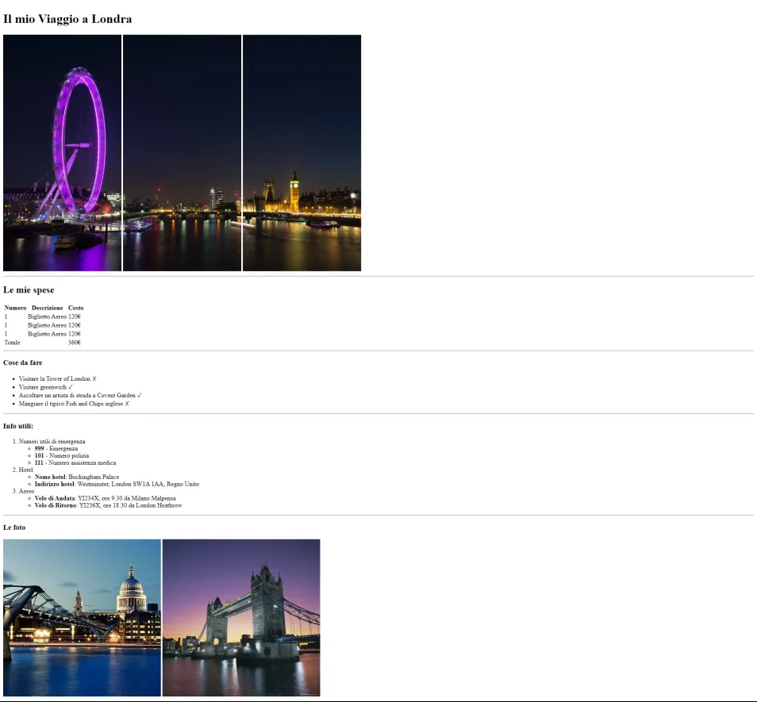

# FIRST HTML EXERCISE

This project is the first exercise in the context of a Web Development Master Course. It is focused on HTML only.

## TASK

The task is re-creating a web-page, provided by the teacher, by using HTML only.

## PROJECT STRUCTURE

Html-london-trip/  
├── index.html  
├── README.md  
├── webpage.png  
└── img/  
&nbsp;&nbsp;&nbsp;&nbsp;├── pexels-bill-emrich-230794-0.jpg  
&nbsp;&nbsp;&nbsp;&nbsp;├── pexels-bill-emrich-230794-1.jpg  
&nbsp;&nbsp;&nbsp;&nbsp;└── pexels-bill-emrich-230794-2.jpg  

## REFERENCE WEBSITE
This is the reference to re-create:

## RATIONALE

I considered the page to include an header and a main. I divided each block between horizonal lines mostly using SECTION tags and assigning a meaningful class to each one. This is to be facilitated in case of adding styles to the project through CSS. I also used a figure block level tag in the header and in the pictures at the end - instead of a section tag - to group the 3 pictures in the header and the 2 pictures at the bottom respectively.

### HTML TAGS USED
inline tags:
- img
- b  
block level tags:
- header
- main
- hr
- h1
- h2
- h3
- section
- figure
- table, and its relative tags
- ol and li
- ul and li